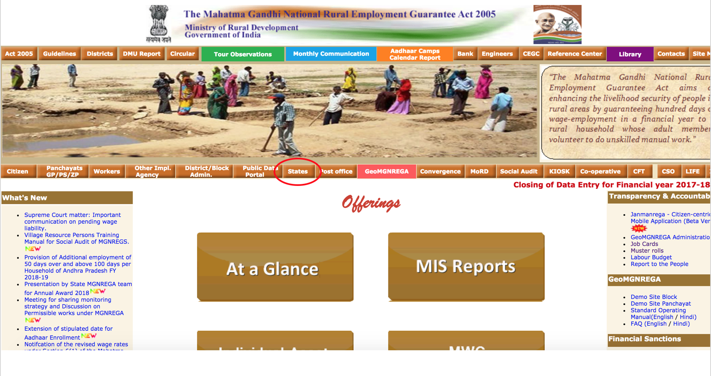
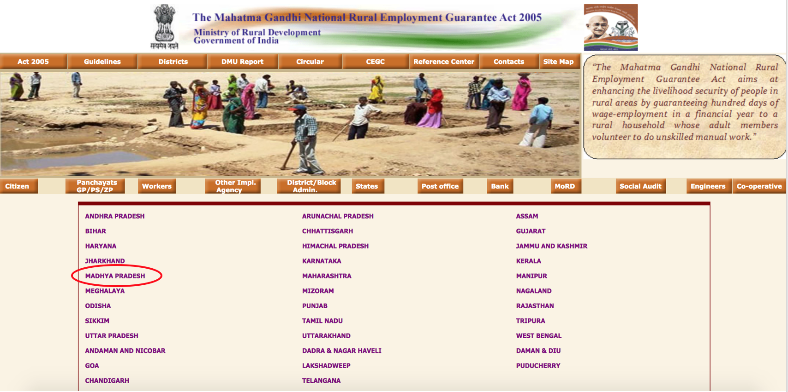
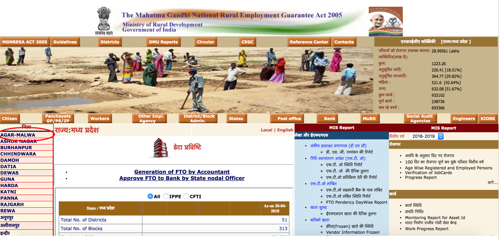
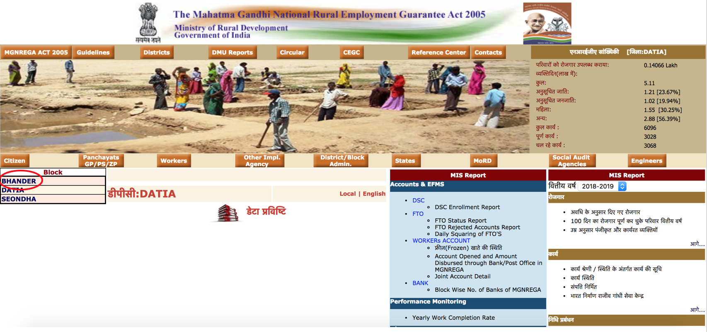
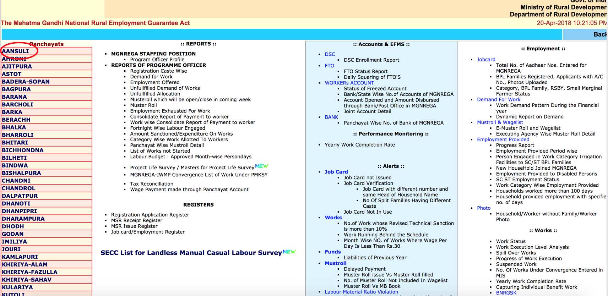
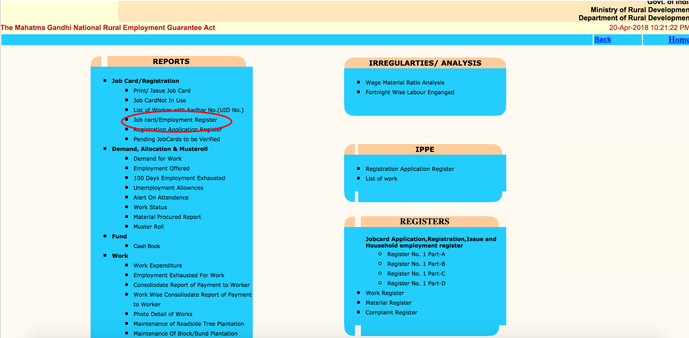

# MGNREGA job card and muster roll scrape for FBA project

## Background

This program gets data on MGNREGA beneficiaries, including their workspells and payments, from the MGNREGA website for use by the EPoD FBA research team. The program uses an input file containing data on the 199 study gram panchayats for which job card and muster roll data will be scraped.

## Scraping strategy

The scrape is split into two phases, each triggered from its own shell script. In the first phase, the program navigates to the job card directory for each gram panchayat and adds the url link for each job card page to the file job_card_urls.csv. The script then uses these links to begin accessing all the individual job card pages in those panchayats. The job card pages contain data on which members of the household are on the job card including their names, gender, and age. This data is added to jobcard.csv as the job card pages are crawled.

The job card pages also include a table showing abbreviated information on work spells for the household, including number of days worked and a link to the muster roll page for that work spell. The program adds these muster roll links to the file encountered_muster_links.csv to be used in the second phase of the scrape.

In the second phase, the program begins accessing all the muster roll pages contained in encountered_muster_links.csv and scraping the full table of data on workers on the muster roll. This data is added to muster.csv.

The scrape is often long running (days to weeks to run), and at times the job card pages are restricted to 12-hour windows where they can only be accessed between 6am and 6pm IST. While accessing the job card pages can be very slow, the muster roll pages typically return data relatively quickly. The strategy of running the program in two phases allows us to kill the job card scrape at the end of the 12 hour window, then start running the muster roll phase to quickly pick up all the muster roll data from the pages gathered in the encountered_muster_links.csv file. When we start the job card scrape back up at the beginning of the next 12 hour window, it looks at the job_card_urls.csv and jobcard.csv files to start the phase 1 scrape where it left off when it was killed. Using this pattern and triggering the shell scripts from cron we can keep the scrape going efficiently over long periods of time.

Note: the file job_card_urls.csv needs to be generated in full the first time phase 1 of the script is run in order for the re-starts to work correctly. It generally only takes a few minutes for the program to access all the job card directory pages and generate this file.

## Running the program

The shell scripts are called separately from cron according to the timing of the 12 hour window. The job card script is called just after 6am IST and the muster script is called just after 6pm IST. The job card shell script uses a SIGINT command to kill the program after it runs for just under 12 hours.

A Python script called check_progress.py is called at the end of each shell script. This file analyzes the progress of the scrape and sends an update email to the email addresses included in the file.

Note: When beginning a new scrape the full_output directory needs to be clear of any data files (putting things in the archive sub-directory is OK). The presence or absence of data files in this directory is how the script decides whether to start a new scrape or continue an existing scrape.

## Manually navigating to the job card directory page

From the nrega.nic.in homepage follow these steps to drill down to your selected gram panchayat and find its job card directory. The job card directory is where the scraping program begins its work.

First, click the "States" button on the main page:

All our gram panchayats are in Madhya Pradesh so we'll click that link on the states page:

Next, choose your district from the left panel. The FBA study is spread across 4 districts of northern Mahdya Pradesh.

Choose your block on the left panel:

Choose your gram panchayat on the left panel:

Select the job card directory from the gram panchayat page:

